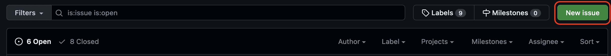
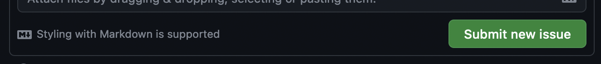
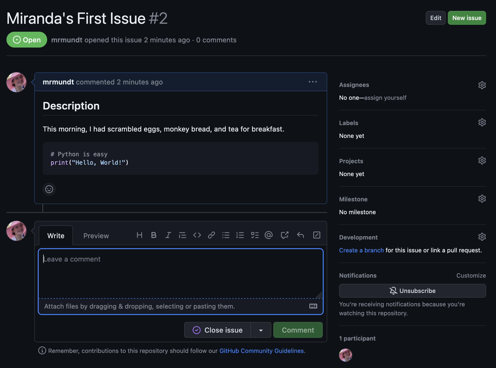
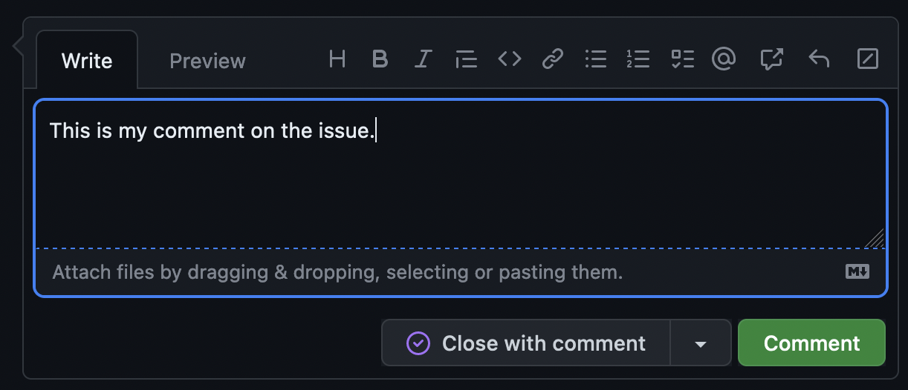
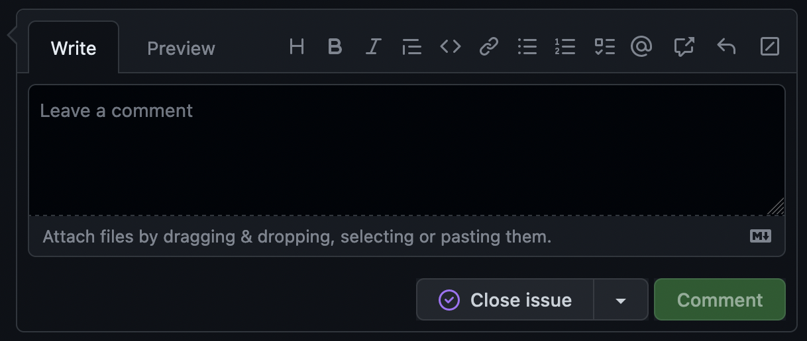
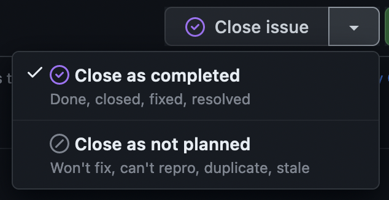

::::::::::::::::::::::::::::::::::::::: objectives

- Recognize what makes an issue clear and actionable.
- Become familiar with basic actions on GitHub Issues.

::::::::::::::::::::::::::::::::::::::::::::::::::

:::::::::::::::::::::::::::::::::::::::: questions

- What makes a *good* issue?
- How do you make an issue?
- How do you interact with an open issue?
- How do you close an issue?

::::::::::::::::::::::::::::::::::::::::::::::::::

## What Makes a *Good* Issue?

Anyone can click "New issue" and type "it's broken." The skill worth learning is writing an
issue a teammate can actually *act on* without a follow-up conversation. A good bug report
usually has:

| Ingredient | Why it matters |
|------------|----------------|
| **Clear, specific title** | "Crash when sorting empty folder" beats "bug" — it's findable and scannable. |
| **Steps to reproduce** | If we can't trigger it, we can't fix it. Number the steps. |
| **Expected vs. actual** | What *should* have happened, and what *did*. |
| **Environment** | OS, version, language version — the details that change behavior. |
| **One issue = one problem** | Don't bundle five bugs in one ticket; they can't be tracked or closed independently. |

A good *feature request* is similar: what you want, **why** (the motivation/use case), and any
alternatives you considered. Keep these in mind for every issue you open today.

## Open an Issue

Click the green **New issue** button (top-right of the Issues page) to start a new issue.

{alt='New issue button circled in red. Button is on the top-right on the Issues page.'}

A new issue has a few parts:

- _Title_: displays on the main Issues page.
- _Write_: the details of the issue — GitHub supports **Markdown** formatting.
- _Preview_: shows the Markdown-rendered version before you submit.

Once it's filled out, the **Submit new issue** button activates.

{alt='Submit new issue button is now highlighted and available to press'}

:::::::::::::::::::::::::::::::::::::::  challenge

## File Your First StarSort Bug

You're testing StarSort and it crashes when you point it at an empty image folder. Time to file
a proper bug report! In **your practice repository's** issue page:

* Open a new issue with a clear, specific **title**
* In the "Write" section, add a `## Steps to Reproduce` heading and number the steps.
* Add a section for **Expected vs. Actual** behavior.
* Include a code block showing the (made-up) error message StarSort printed.
* **Preview** to check your Markdown, then **submit**!

::::::::::::::::::::::::::::::::::::::::::::::::::

::::::::::::::::::::::::::::::::::::::::::  callout

## GenAI: from messy notes to a clean report

Bug reports often start as a jumble: "it broke when the folder was empty, error said
IndexError, was on my mac." Try pasting notes like that into an LLM and asking it to format a
bug report with steps to reproduce and expected/actual sections. Then **check it against the
good issue table** — did it invent steps or details you didn't give it? You supply the facts; the AI
just tidies the structure.

::::::::::::::::::::::::::::::::::::::::::::::::::::::

On the right-hand side, there are more options that can be modified.

- _Assignee_: Here you can choose a specific person to this issue.
- _Labels_: Here you can add a label to the issue (we will discuss this more later!).
- _Projects_: Here you can add the issue to a project board.
- _Milestone_: Here you can add the issue to a milestone.

:::::::::::::::::::::::::::::::::::::::::  callout

## Authorization Required

You will only be able to edit these options if you have the
appropriate permissions!

::::::::::::::::::::::::::::::::::::::::::::::::::

## Interact with an Open Issue

There are many interactions available on an open issue.

{alt='A basic open issue based on the exercise above - Title "Mirandas First Issue", status "Open", basic content in the "Write" section'}

The most basic interaction with an open issue is leaving a comment. This is
how you can interact with the issue author, the assignee, and others who
have commented on or subscribed to the issue.

Simply click in the comment box at the bottom of the issue, type whatever
you'd like, and click "Comment."

{alt='Image showing how to add a comment box on a new issue'}

:::::::::::::::::::::::::::::::::::::::::  callout

## Close by mistake?

Did you accidentally click "Close with comment"? No worries, you can easily
reopen it by clicking the "Reopen" button!

::::::::::::::::::::::::::::::::::::::::::::::::::

You can do other actions like "Edit" the title or original issue information,
tag other users, link to other issues or pull requests, and more.

:::::::::::::::::::::::::::::::::::::::  challenge

## Loop in a Maintainer

A StarSort maintainer should know about your bug. Navigate to your issue from the previous
exercise.

* Write a new comment on the issue, mentioning your instructor using
  the `@` symbol.
* Add the comment to the issue.

::::::::::::::::::::::::::::::::::::::::::::::::::

## Close an Issue

Good news — a maintainer "fixed" your StarSort bug! The work is done and the discussion is
over, so we don't want it cluttering up the open-issues list anymore.

Closing an issue is simple - just click the "Close issue" button.

{alt='Close issue button with no additional features'}

If you start to type in the comment box, this will change into a "Close with 
comment" button.

The dropdown to the right shows two more options:

{alt='Extra Close issue button options displayed - "Close as completed" and "Close as not completed"'}

:::::::::::::::::::::::::::::::::::::::  challenge

## Issue Completed

Navigate to your issue from the previous exercises.
 
* Close the issue (no comment!)
* Reopen the issue
* Close the issue again with a comment of your choice

::::::::::::::::::::::::::::::::::::::::::::::::::

You now know the basic actions you can take on a GitHub issue!

:::::::::::::::::::::::::::::::::::::::: keypoints

- A good issue has a clear title, steps to reproduce, expected vs. actual behavior, and covers one problem.
- New issues can be opened in a repository using the 'New issue' button.
- Text on issues use Markdown styling for formatting.
- A user can interact with issues in multiple ways: commenting, mentioning others, linking to other issues and pull requests, and more.
- GenAI can format messy notes into a structured report, but you must supply and verify the facts.

::::::::::::::::::::::::::::::::::::::::::::::::::

