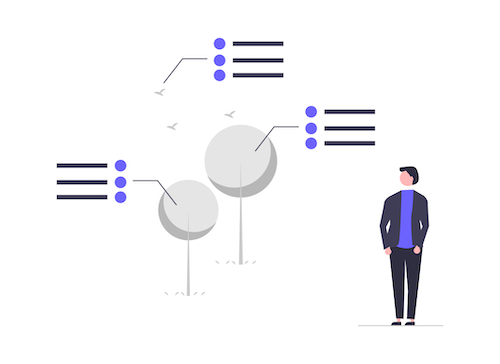
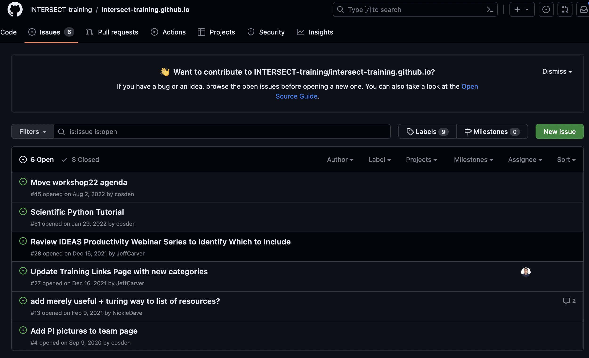

::::::::::::::::::::::::::::::::::::::: questions

- What is issue tracking?
- Why is issue tracking useful?

::::::::::::::::::::::::::::::::::::::::::::::::::

:::::::::::::::::::::::::::::::::::::::: objectives

- Understand the purpose and benefits of issue trackers
- Become familiar with GitHub Issues

::::::::::::::::::::::::::::::::::::::::::::::::::

## What is Issue Tracking?

Issue tracking is an activity that happens as part of Project Management. In
this activity, a record is made of bugs, enhancements, and requests in such
a way that the team is able to view and access the list of work to be
done.

Issues are used to collaborate, solve problems, and plan work, which is 
enabled by software tools such as GitLab issues, Jira story boards, and GitHub issues.

{alt='Collaborative tracking in the public eye. Decorative image of no substance.'}

Issue trackers can be internal (team-facing) or external (user-facing). In
this lesson, students will learn about issue tracking through the use of GitHub
Issues.

::::::::::::::::::::::::::::::::::::::::::  callout

## Your mission: welcome to the StarSort team!

To make this concrete, you'll spend this lesson role-playing a new contributor to
**StarSort** — a (fictional) open-source research tool that sorts and catalogs telescope
images. The maintainers are friendly but swamped, and the issue tracker is how the whole team
tracks work. Throughout the lesson you'll file bug reports, triage the backlog, and set up
templates — just like a real contributor would.

(You'll do all of this in **your own practice repository** — StarSort is just the story we'll
use to make it fun.)

::::::::::::::::::::::::::::::::::::::::::::::::::::::

## The Benefits of Issue Tracking

Why bother, instead of a pile of sticky notes and "I'll remember it" promises?

| Benefit | What it gives you |
|---------|-------------------|
| **Visibility** | All the work to be done lives in one place every team member can see. |
| **Collaboration** | Work can be captured, organized, discussed, and assigned in a single location. |
| **Transparency** | If the tracker is user-facing, users can follow progress and chime in. |

::::::::::::::::::::::::::::::::::::::::::  callout

## Where does genAI fit?

Generative AI (LLMs like ChatGPT and Claude) is surprisingly handy for issue tracking — it can
turn messy notes into a clear bug report, suggest labels, or summarize a long discussion
thread. We'll point out useful spots throughout the lesson. The catch, as always: the AI
drafts, but **you** review for accuracy.

::::::::::::::::::::::::::::::::::::::::::::::::::::::

## GitHub Issues

Numerous different issue tracking systems exist - both commercial and open-source,
integrated and stand-alone.

GitHub integrates issue tracking right into version control: every project on GitHub can
enable an issue tracker, reached from the **Issues** tab in the repository's navigation bar.

{alt='INTERSECT training repository navigation bar, showing, from left to right: Code, Issues, Pull Requests, Actions, Projects, Security, Insights'}

The Issues page lists all open issues; click any one to read its details and discussion. You
can filter the list by status (Open/Closed), author, label, and more.

{alt='INTERSECT training repository Issues pages'}

:::::::::::::::::::::::::::::::::::::::  challenge

## Scavenger Hunt: Browsing Open Issues

A real project's tracker can be huge. Let's explore one. Navigate to
[https://github.com/spack/spack](https://github.com/spack/spack) and find the issues page.

* How many issues are currently open?
* How many have been closed?
* How many labels are there?

:::::::::::::::::::::: solution

Open vs. closed counts are the toggles at the top of the issues list; the label count is on the
**Labels** button (or the `/labels` page). The exact numbers change daily — that's the point:
the tracker is dynamic and constantly updated.

::::::::::::::::::::::

::::::::::::::::::::::::::::::::::::::::::::::::::

:::::::::::::::::::::::::::::::::::::::: keypoints

- Issue tracking is the process of monitoring problems and requests for a software product.
- Issue tracking enables a software development team to capture, organize, and manage work collaboratively.

::::::::::::::::::::::::::::::::::::::::::::::::::

